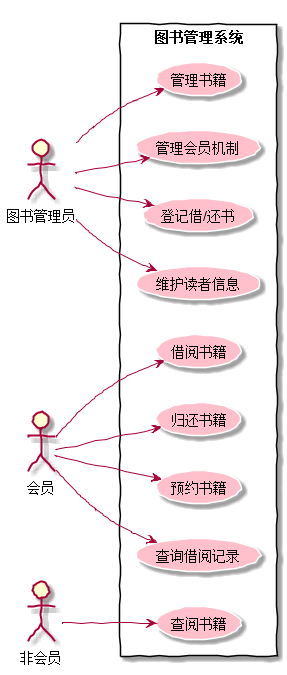

# 实验2：图书管理系统用例建模（老师示范）
|学号|班级|姓名|照片|
|:----------:|:---------:| :----:|:-----:|
|201510414107|软件(本)15-1|高强||

## 1. 图书管理系统的用例关系图

### 1.1 用例图PlantUML源码如下：

``` usecase
@startuml
left to right direction
skinparam handwritten true
skinparam usecase{
    BackgroundColor pink
    BorderColor pastel blue
}
图书管理员 as admin
会员 as vip
非会员 as nvip
rectangle 图书管理系统{
    admin --> (管理书籍)
    admin --> (管理会员机制)
    admin --> (登记借/还书)
    admin --> (维护读者信息)
    vip --> (借阅书籍)
    vip --> (归还书籍)
    vip --> (预约书籍)
    vip --> (查询借阅记录)
    nvip --> (查阅书籍)
}
@enduml
```


### 1.2. 用例图如下：

参见图7.6



## 2. 参与者说明：

###     2.1 图书管理员

主要职责是：添加新书，增加会员，登记借书，登记还书，维护读者信息

###     2.2 会员

主要职责是：借阅书籍，归还书籍

###     2.3 非会员（路人）
    
主要职责是：查阅书籍

##     3. 用例

###     3.1 “借阅图书”用例
####    3.1.1 “借阅图书”用例规约表

|用例名称|借阅图书|
|:----------:|:---------:|
|参与者|会员|
|前置条件|登录系统<br>书籍存在|
|后置条件|借阅成功|
|主事件流|①查阅书籍<br>②找图书管理员登记|
|备选事件流|①没有书籍<br>②已被借出|
|业务规则|图书管理员工作时间是朝九晚五|
####    3.1.2 “借阅图书”用例流程图源码如下：
```
@startuml
|会员|
start

:查询书籍;
|会员|
|图书管理系统|
if(书籍是否存在) then (存在)
if(是否已被借出) then (否)
:登记借书记录;
else (是)
:借书失败;
endif
else (不存在)
:借书失败;
endif
|图书管理系统|
|会员|
:借书结束;
stop
@enduml
```
####    3.1.3 "借阅图书"用例流程图如下:

###     3.2 “归还图书”用例

####    3.2.1 “归还图书”用例规约表
|用例名称|归还图书|
|:----------:|:---------:|
|参与者|会员|
|前置条件|登录系统|
|后置条件|归还成功|
|主事件流|①找图书管理员登记|
|备选事件流|①超过归还时间，给额外费用|
|业务规则|图书管理员工作时间是朝九晚五|
####    3.2.2 “归还图书”用例流程图源码如下：
```@startuml
   |会员|
   start
   
   :归还书籍;
   |会员|
   |图书管理系统|
   :登记还书记录;
   :刷新图书记录;
   |图书管理系统|
   |会员|
   :还书结束;
   stop
   @enduml
   ```
####    3.2.3 "归还图书"用例流程图如下:

###    3.3 "预约图书"用例
####   3.3.1 “预约图书”用例规约表:
|用例名称|预约图书|
|:----------:|:---------:|
|参与者|会员|
|前置条件|登录系统|
|后置条件|预约成功|
|主事件流|①找图书管理员登记|
|备选事件流|①预约失败|
|业务规则|图书管理员工作时间是朝九晚五|
####   3.3.2 “预约图书”用例流程图源码如下：
```@startuml
   |会员|
   start
   
   :查询书籍;
   |会员|
   |图书管理系统|
   if(书籍是否存在) then (存在)
   if(是否已被借出) then (否)
   :预约成功,并登记预约记录;
   else (是)
   :预约失败;
   endif
   else (不存在)
   :预约失败;
   endif
   |图书管理系统|
   |会员|
   :预约结束;
   stop
   @enduml
   ```
####   3.3.3 "预约图书"用例流程图如下:

###    3.3 "管理图书"用例
####   3.3.1 “管理图书”用例规约表:
|用例名称|管理图书|
|:----------:|:---------:|
|参与者|会员|
|前置条件|登录系统|
|后置条件|CRUD成功|
|主事件流|①找图书管理员登记|
|备选事件流|①CRUD失败,询求超级管理员帮助|
|业务规则|图书管理员工作时间是朝九晚五|
####   3.3.2 “管理图书”用例流程图源码如下：
```@startuml
   :图书管理;
   fork
   :新增书籍;
   :刷新书籍记录;
   fork again
   :删除书籍;
   :刷新书籍记录;
   fork again
   :查询书籍;
   :查询结果;
   fork again
   :修改书籍;
   :刷新书籍记录;
   end fork
   :管理结束;
   @enduml
   ```
####   3.3.3 "管理图书"用例流程图如下:
