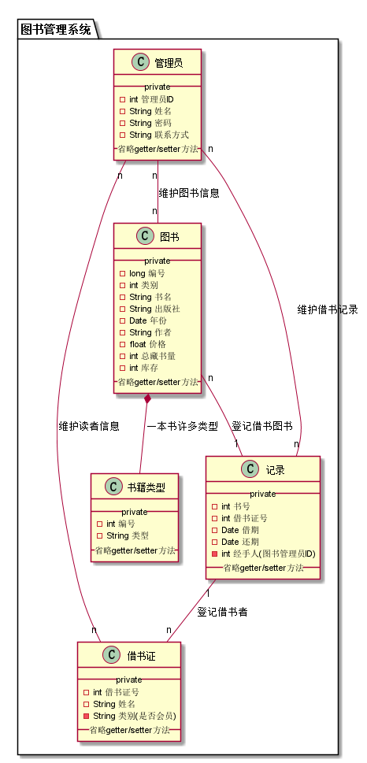
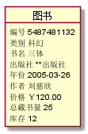
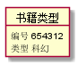
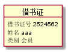
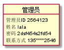
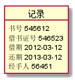

# 实验2：图书管理系统用例建模（老师示范）
|学号|班级|姓名|照片|
|:----------:|:---------:| :----:|:-----:|
|201510414107|软件(本)15-1|高强||

# 1.图书管理系统类图

##1.1PlantUML源码如下：

``` @startuml
    package "图书管理系统"{
        class 图书{
            __private__
            -long 编号
            -int 类别
            -String 书名
            -String 出版社
            -Date 年份
            -String 作者
            -float 价格
            -int 总藏书量
            -int 库存
            __省略getter/setter方法__
        }
    
        class 书籍类型{
            __private__
            -int 编号
            -String 类型
            __省略getter/setter方法__
        }
    
        class 借书证{
                __private__
                -int 借书证号
                -String 姓名
                -String 类别(是否会员)
                __省略getter/setter方法__
        }
    
        class 管理员{
                __private__
                -int 管理员ID
                -String 姓名
                -String 密码
                -String 联系方式
                __省略getter/setter方法__
        }
    
        class 记录{
                __private__
                -int 书号
                -int 借书证号
                -Date 借期
                -Date 还期
                -int 经手人(图书管理员ID)
                __省略getter/setter方法__
        }
    
        图书 *-- 书籍类型 : 一本书许多类型
        图书 "n" -- "1" 记录 : 登记借书图书
        记录 "1" -- "n" 借书证 : 登记借书者
        管理员 "n" -- "n" 借书证 : 维护读者信息
        管理员 "n" -- "n" 图书 : 维护图书信息
        管理员 "n" -- "n" 记录 : 维护借书记录
    
    }
    @enduml
```


##1.2类图如下：



##1.3. 类图说明
该类图由“图书”，“书籍类型”，“借书证”，“管理员”，“记录”等实体类构成，之间由聚集，组合等关系相关联，类图中是该类的各种属性

# 2. 图书管理系统的对象图

## 1.1 类"图书"的对象源码
```
@startuml
Object 图书
图书 : 编号 5487481132
图书 : 类别 科幻
图书 : 书名 三体
图书 : 出版社 **出版社
图书 : 年份 2005-03-26
图书 : 作者 刘慈欣
图书 : 价格 ￥120.00
图书 : 总藏书量 25
图书 : 库存 12
@enduml
```
# 1.2 类"图书"的对象图



## 2.1 类"书籍类型"的对象源码
```
@startuml
Object 书籍类型
书籍类型 : 编号 654312
书籍类型 : 类型 科幻
@enduml
```
## 2.2 类"书籍类型"的对象图




## 3.1 类"借书证"的对象源码
```
@startuml
Object 借书证
借书证 : 借书证号 2524562
借书证 : 姓名 aaa
借书证 : 类别 会员
@enduml
```
## 3.2 类"借书证"的对象图



## 4.1 类"管理员"的对象源码
```
@startuml
Object 管理员
管理员 : 管理员ID 2564123
管理员 : 姓名 lala
管理员 : 密码 2dsf454s2fd54
管理员 : 联系方式 135****2546
@enduml
```
## 4.2 类"管理员"的对象图



## 5.1 类"记录"的对象源码
```
@startuml
Object 记录
记录 : 书号 545612
记录 : 借书证号 546523
记录 : 借期 2012-03-12
记录 : 还期 2013-03-12
记录 : 经手人 56451
@enduml
```
## 5.2 类"记录"的对象图

