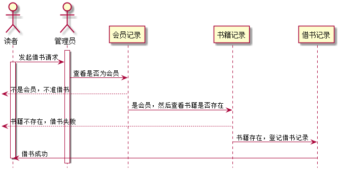
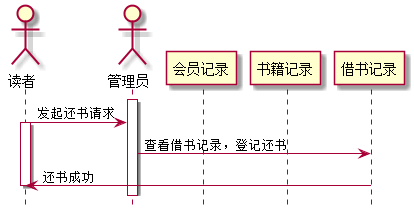
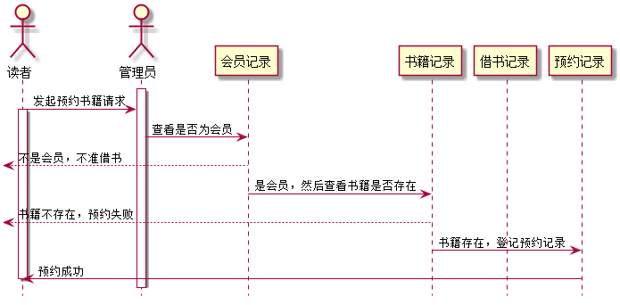
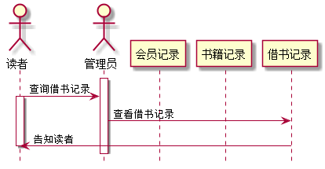
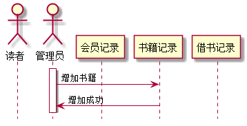
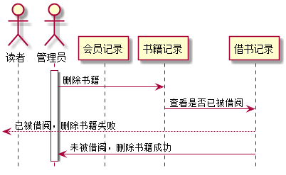
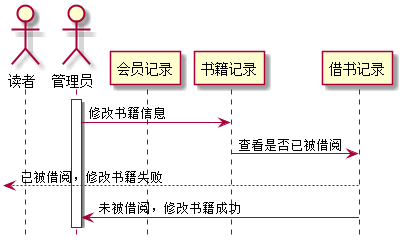
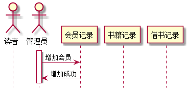
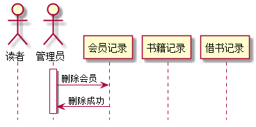
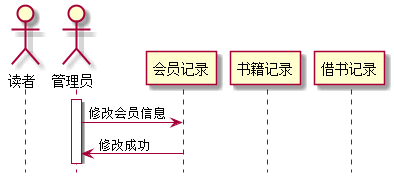

# 实验4：图书管理系统顺序图绘制
|学号|班级|姓名|照片|
|:----------:|:---------:| :----:|:-----:|
|201510414107|软件(本)15-1|高强||

# 1.借出图书

## 1.1 PlantUML源码如下：

``` 
@startuml
hide footbox

actor 读者
actor 管理员

participant 会员记录
participant 书籍记录
participant 借书记录

activate 管理员

读者->管理员:发起借书请求
activate 读者

管理员->会员记录:查看是否为会员
[<--会员记录:不是会员，不准借书
会员记录->书籍记录:是会员，然后查看书籍是否存在
[<--书籍记录:书籍不存在，借书失败
书籍记录->借书记录:书籍存在，登记借书记录
借书记录->读者:借书成功
deactivate 读者
@enduml
```


## 1.2 用例顺序图如下：



## 1.3. 借出图书说明
参与者：读者、管理员、会员记录、书籍记录、借书记录

# 2. 归还图书

## 2.1 PlantUML源码如下：
```
@startuml
hide footbox

actor 读者
actor 管理员

participant 会员记录
participant 书籍记录
participant 借书记录

activate 管理员

读者->管理员:发起还书请求
activate 读者

管理员->借书记录:查看借书记录，登记还书
借书记录->读者:还书成功
deactivate 读者
@enduml
```
## 2.2 用例顺序图如下：



## 2.3 归还图书说明
参与者：读者、管理员、会员记录、书籍记录、借书记录

# 3 预约图书
## 3.1 PlantUML源码如下：
```
@startuml
hide footbox

actor 读者
actor 管理员

participant 会员记录
participant 书籍记录
participant 借书记录

activate 管理员

读者->管理员:发起预约书籍请求
activate 读者

管理员->会员记录:查看是否为会员
[<--会员记录:不是会员，不准借书
会员记录->书籍记录:是会员，然后查看书籍是否存在
[<--书籍记录:书籍不存在，预约失败
书籍记录->预约记录:书籍存在，登记预约记录
预约记录->读者:预约成功
deactivate 读者
@enduml
```
## 3.2 用例顺序图如下：



## 3.3 预约图书说明
参与者：读者、管理员、会员记录、书籍记录、借书记录

# 4 查询借书记录

## 4.1 PlantUML源码如下：
```
@startuml
hide footbox

actor 读者
actor 管理员

participant 会员记录
participant 书籍记录
participant 借书记录

activate 管理员

读者->管理员:查询借书记录
activate 读者

管理员->借书记录:查看借书记录
借书记录->读者:告知读者
deactivate 读者
@enduml
```
## 4.2 用例顺序图如下：


## 4.3 查询借书记录说明
参与者：读者、管理员、会员记录、书籍记录、借书记录


# 5 增加书籍

## 5.1 PlantUML源码如下：
```
@startuml
hide footbox

actor 读者
actor 管理员

participant 会员记录
participant 书籍记录
participant 借书记录

activate 管理员
管理员->书籍记录:增加书籍
书籍记录->管理员:增加成功
@enduml
```
## 5.2 用例顺序图如下：


## 5.3 增加书籍说明
参与者：读者、管理员、会员记录、书籍记录、借书记录

# 6 删除书籍

## 6.1 PlantUML源码如下：
```
@startuml
hide footbox

actor 读者
actor 管理员

participant 会员记录
participant 书籍记录
participant 借书记录

activate 管理员

管理员->书籍记录:删除书籍
书籍记录->借书记录:查看是否已被借阅
[<--借书记录:已被借阅，删除书籍失败
借书记录->管理员:未被借阅，删除书籍成功
@enduml
```
## 6.2 用例顺序图如下：


## 6.3 删除书籍说明
参与者：读者、管理员、会员记录、书籍记录、借书记录

# 7 修改书籍信息

## 7.1 PlantUML源码如下：
```
@startuml
hide footbox

actor 读者
actor 管理员

participant 会员记录
participant 书籍记录
participant 借书记录

activate 管理员


管理员->书籍记录:修改书籍信息
书籍记录->借书记录:查看是否已被借阅
[<--借书记录:已被借阅，修改书籍失败
借书记录->管理员:未被借阅，修改书籍成功
@enduml
```
## 7.2 用例顺序图如下：


## 7.3 修改书籍信息说明
参与者：读者、管理员、会员记录、书籍记录、借书记录

# 8 增加会员

## 8.1 PlantUML源码如下：
```
@startuml
hide footbox

actor 读者
actor 管理员

participant 会员记录
participant 书籍记录
participant 借书记录

activate 管理员

管理员->会员记录:增加会员
会员记录->管理员:增加成功
@enduml
```
## 8.2 用例顺序图如下：


## 8.3 增加会员说明
参与者：读者、管理员、会员记录、书籍记录、借书记录

# 9 删除会员

## 9.1 PlantUML源码如下：
```
@startuml
hide footbox

actor 读者
actor 管理员

participant 会员记录
participant 书籍记录
participant 借书记录

activate 管理员

管理员->会员记录:删除会员
会员记录->管理员:删除成功
@enduml
```
## 9.2 用例顺序图如下：


## 9.3 删除会员说明
参与者：读者、管理员、会员记录、书籍记录、借书记录

# 10 查询会员

## 10.1 PlantUML源码如下：
```
@startuml
hide footbox

actor 读者
actor 管理员

participant 会员记录
participant 书籍记录
participant 借书记录

activate 管理员


管理员->会员记录:查询会员
会员记录->管理员:查询成功

@enduml
```
## 10.2 用例顺序图如下：


## 10.3 查询会员说明
参与者：读者、管理员、会员记录、书籍记录、借书记录

# 11 修改会员信息

## 11.1 PlantUML源码如下：
```
@startuml
hide footbox

actor 读者
actor 管理员

participant 会员记录
participant 书籍记录
participant 借书记录

activate 管理员

管理员->会员记录:修改会员信息
会员记录->管理员:修改成功
@enduml

```
## 11.2 用例顺序图如下：


## 11.3 修改会员信息说明
参与者：读者、管理员、会员记录、书籍记录、借书记录
