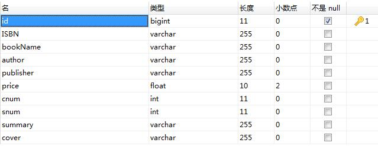
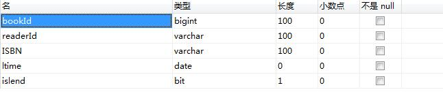
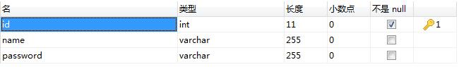
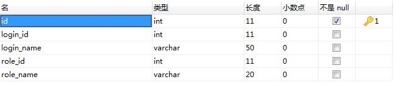
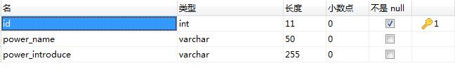
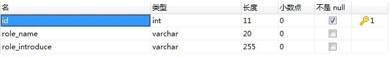
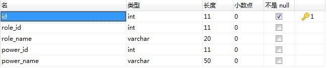
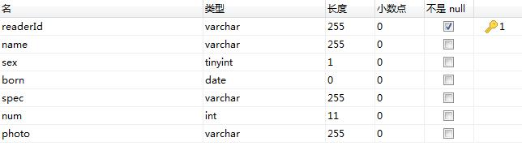

# 实验5：图书管理系统数据库设计与界面设计
|学号|班级|姓名|照片|
|:----------:|:---------:| :----:|:-----:|
|201510414107|软件(本)15-1|高强||


# 1.数据库表设计
## 1.1.图书表


## 1.2.借书表


## 1.3.用户表


## 1.4.用户-角色关联表


## 1.5.权限表


## 1.6.角色表


## 1.7.角色-权限关联表


## 1.8.学生表


# 2.界面设计

# 2.1.借书界面设计

- 用例图参见：借书用例
- 类图参见：借书类，读者类
- 顺序图参见：借书顺序图
- API接口如下：

1. 获取全部已借图书

- 功能：用于获取所有已借图书
- 请求地址： http://[YOUR_DOMAIN]/selectAllLend.action
- 请求方法：get
- 请求参数：无

|参数名称|必填|说明|
|:-------:|:-------------: | :----------:|
|method|是|固定为 “GET”。|

- 返回实例：
```
{
    "info": "success",
    "total":50,
    "data": {
        ["bookId": "31545",
        "readerId": "14361",
        "bookName": "安徒生童话",
        "publisher": "人民出版社",
        "price": "￥35.00",
        "isbn": "978-753-88-65-370",
        "ltime": "2015-12-02"]
    },
    "code": 200
}
```
- 返回参数说明：
    
|参数名称|说明|
|:-------:|:-------------: |
|Info|返回信息|
|total|共有多少本|
|data|图书信息|
|dodo|返回码|


1. 借阅图书

- 功能：用于借阅图书
- 请求地址： http://[YOUR_DOMAIN]/lendBookLend.action
- 请求方法：post
- 请求参数：借阅图书id

|参数名称|必填|说明|
|:-------:|:-------------: | :----------:|
|method|是|"post"|

- 返回实例：
```
{
    "info": "success",
    "data": {
        null
    },
    "code": 200
}
```
- 返回参数说明：
    
|参数名称|说明|
|:-------:|:-------------: |
|Info|返回信息|
|data|图书信息|
|dodo|返回码|

