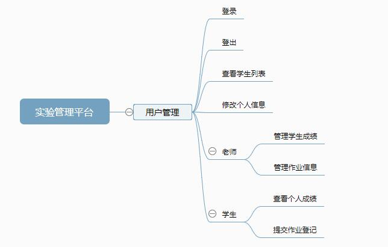
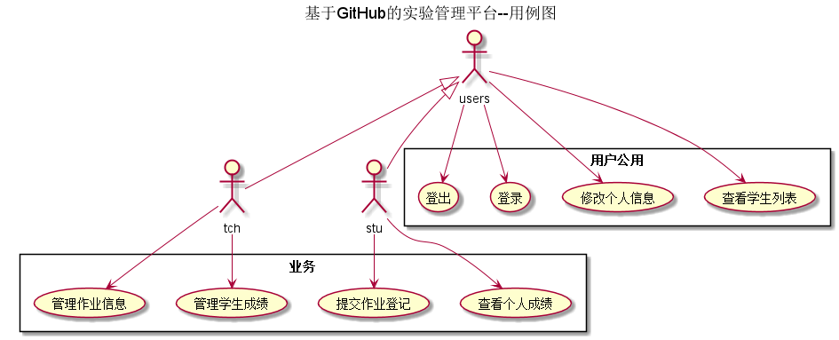
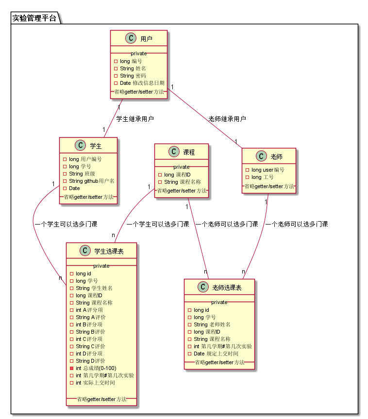

# 实验6：基于GitHub的实验管理平台的分析与设计
|学号|班级|姓名|照片|
|:----------:|:---------:| :----:|:-----:|
|201510414107|软件(本)15-1|高强||

## 1. 概述
- 基于GitHub的实验管理平台的作用是在线管理实验成绩的Web应用系统。学生和老师的实验内容均存放在GitHUB
页面上。
- 学生的功能主要有：一是设置自己的GitHub用户名，二是查询自己的实验成绩。学生的GitHub用户名是公开的，但成绩不公开。
- 老师的功能主要有：一是批改每个学生的成绩，二是查看每个学生的成绩。
- 老师和学生都能通过本系统的链接方便地跳转到学生的每个GitHUB实验目录，以便批改实验或者查看实验情况。
- 实验成绩按数字分数计算，每项实验的满分为100分，最低为0分。
- 系统自动计算每个学生的所有实验的平均分。

## 2. 系统总体结构

界面设计参见：

## 3. 用例图设计 [源码](./src/testManagePlatform.puml)

## 4. 类图设计 [源码](./src/classPicture.puml)

## 5. 数据库设计
- ### [参见数据库设计](./sql.md)

## 6. 用例及界面详细设计
- ### [“用户登录”用例](./login.md),[界面](https://gqbzd.github.io/is_analysis/test6/ui/login.html)
- ### [“用户注销”用例](./logout.md),[界面](https://gqbzd.github.io/is_analysis/test6/ui/logout.html)
- ### [“修改信息”用例](./modMsg.md),[界面](https://gqbzd.github.io/is_analysis/test6/ui/modmsg.html)
- ### [“学生列表”用例](./studentList.md),[界面](https://gqbzd.github.io/is_analysis/test6/ui/studentlist.html)
- ### [“查询个人成绩”用例](./showGrade.md),[界面](https://gqbzd.github.io/is_analysis/test6/ui/showgrade.html)
- ### [“提交作业登记”用例](./submitRegist.md),[界面](https://gqbzd.github.io/is_analysis/test6/ui/submitregist.html)
- ### [“学生成绩管理”用例](./stuGradeManage.md),[界面](https://gqbzd.github.io/is_analysis/test6/ui/stugrademanage.html)
- ### [“作业管理”用例](./taskPublish.md),[界面](https://gqbzd.github.io/is_analysis/test6/ui/taskpublish.html)
