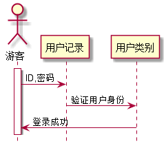

# “用户登录”用例 [返回](../README.md)

## 1. 用例规约
|用例名称|用户登录|
|-------|:-------------|
|功能|本系统的用户登录以便查看相关信息|
|参与者|游客|
|前置条件|访问登录页面|
|后置条件| |
|主事件流| |
|备选事件流| |

## 2. 业务流程（顺序图） [源码](src/login.puml)
 

## 3. 界面设计
- 界面参照: https://zwdbox.github.io/is_analysis/test6/ui/index.html
- API接口调用
    - 接口1：[login](./interface/loginInterface.md) 
    
## 4. 算法描述
根据用户ID来判断是老师还是学生,继而给予不同的权限

## 5. 参照表

- [USERS](../sql.md/#USERS)
