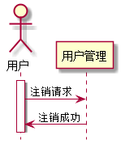

# “用户注销”用例 [返回](../README.md)

## 1. 用例规约
|用例名称|用户注销|
|-------|:-------------|
|功能|本系统的用户注销离开|
|参与者|老师or学生|
|前置条件|点击注销按钮|
|后置条件| |
|主事件流| |
|备选事件流| |

## 2. 业务流程（顺序图） [源码](src/logout.puml)
 

## 3. 界面设计
- 界面参照: https://zwdbox.github.io/is_analysis/test6/ui/index.html
- API接口调用
    - 接口1：[logout](./interface/logoutInterface.md) 
    
## 4. 算法描述
通过session中的登录状态来设置用户是否在线

## 5. 参照表

- 无
