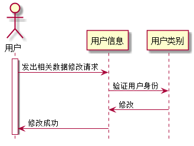

# “修改个人信息”用例 [返回](../README.md)

## 1. 用例规约
|用例名称|修改个人信息|
|-------|:-------------|
|功能|用户修改自己的相关信息，如密码、github帐户名等与自己相关的|
|参与者|老师or学生|
|前置条件|已登录|
|后置条件| |
|主事件流| |
|备选事件流| |

## 2. 业务流程（顺序图） [源码](src/modMsg.puml)
 

## 3. 界面设计
- 界面参照: https://zwdbox.github.io/is_analysis/test6/ui/index.html
- API接口调用
    - 接口1：[modMsgInterface](./interface/modMsgInterface.md) 
    
## 4. 算法描述
根据用户ID来判断是老师还是学生,并且判断出操作目标，再做出修改。

## 5. 参照表

- [USERS](../sql.md/#USERS)
- [STUDENTS](../sql.md/#STUDENTS)
- [TEACHERS](../sql.md/#TEACHERS)
