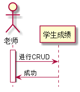

# “学生成绩管理”用例 [返回](../README.md)

## 1. 用例规约
|用例名称|学生成绩管理|
|-------|:-------------|
|功能|对学生成绩进行CRUD|
|参与者|老师|
|前置条件|学生已提交或学生未按时完成|
|后置条件| |
|主事件流| |
|备选事件流| |

## 2. 业务流程（顺序图） [源码](src/stuGradeManage.puml)
 

## 3. 界面设计
- 界面参照: https://zwdbox.github.io/is_analysis/test6/ui/index.html
- API接口调用
    - 接口1：[stuGradeManageInterface](./interface/stuGradeManageInterface.md) 
    
## 4. 算法描述
无

## 5. 参照表

- [USERS](../sql.md/#USERS)
- [STUDENTS](../sql.md/#STUDENTS)
- [STU_LESSON](../sql.md/#STU_LESSON)
