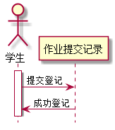

# “提交作业登记”用例 [返回](../README.md)

## 1. 用例规约
|用例名称|提交作业登记|
|-------|:-------------|
|功能|提交作业登记,以便老师检查是否按时完成作业|
|参与者|学生|
|前置条件|无|
|后置条件| |
|主事件流| |
|备选事件流| |

## 2. 业务流程（顺序图） [源码](src/submitRegist.puml)
 

## 3. 界面设计
- 界面参照: https://zwdbox.github.io/is_analysis/test6/ui/index.html
- API接口调用
    - 接口1：[submitRegistInterface](./interface/submitRegistInterface.md) 
    
## 4. 算法描述
无

## 5. 参照表

- [USERS](../sql.md/#USERS)
- [STUDENTS](../sql.md/#STUDENTS)
- [STU_LESSON](../sql.md/#STU_LESSON)
